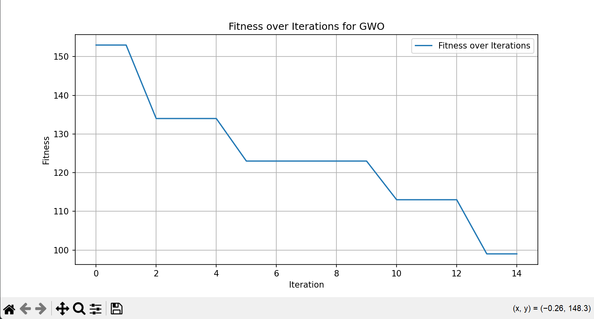

# Multi-Level Processor Scheduling using Gray Wolf Optimization

This project implements a multi-level processor scheduling algorithm using the Gray Wolf Optimization (GWO) technique.

## Overview

Processor scheduling is a fundamental aspect of operating system design, ensuring that processes are allocated appropriate time slots on the CPU. This project demonstrates the use of the Gray Wolf Optimization algorithm to solve a multi-level processor scheduling problem, aiming to optimize the waiting time and priority handling of processes.

## Problem Description

In a multi-level processor scheduling problem, processes are assigned to different queues based on their priority. The goal is to schedule these processes efficiently within a given time frame (`upper_bound`). The challenge lies in determining the optimal distribution of CPU time among the queues to minimize the overall waiting time and ensure higher-priority processes are given preference.

## Parameters

- **Number of Queues (`num_queues`)**: Represents the different priority levels of processes. Each queue can have its own scheduling policy.
- **Number of Wolves (`num_wolves`)**: Represents the number of candidate solutions (wolves) in the GWO algorithm.
- **Maximum Iterations (`max_iter`)**: The number of iterations the GWO algorithm will run to find the optimal solution.
- **Lower Bound (`lower_bound`)**: The minimum time a queue can be allocated for scheduling processes.
- **Upper Bound (`upper_bound`)**: The total available time for scheduling processes across all queues.
- **Priority**: Each process is assigned a priority, determining its queue. Higher priority processes are scheduled before lower priority ones.

## Scheduling Logic

The code schedules processes for a total duration of `upper_bound` time. It allocates time slots to each queue based on the GWO algorithm but does not dictate the scheduling policy within each queue. This flexibility allows different scheduling algorithms to be used within each queue. In this implementation, Shortest Job First (SJF) is used within each queue to further optimize the waiting time of processes.

### Key Points

- **Total Scheduling Time (`upper_bound`)**: The code ensures that the sum of scheduled times across all queues does not exceed the `upper_bound`.
- **Queue Allocation**: The GWO algorithm allocates time slots to each queue based on the positions of wolves, aiming to minimize the overall waiting time and prioritize higher priority queues.
- **Internal Scheduling**: Within each queue, processes are scheduled using the SJF algorithm, but this can be replaced with any other scheduling algorithm as needed.

## DEMO
The example in the script defines 13 processes with varying arrival times, remaining times, and priorities. The GWO algorithm optimizes the scheduling of these processes over a specified number of iterations.

### Results
The results include the best fitness score and position found, along with a plot of fitness over iterations.

